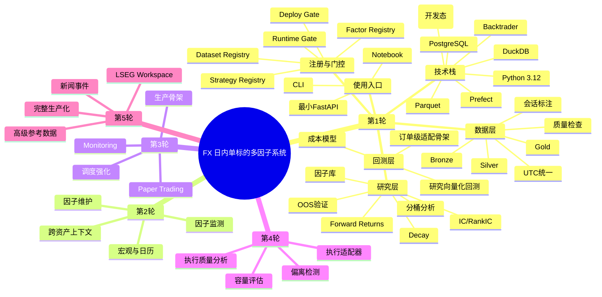

# 外汇日内单标的多因子系统工程框架思维导图

这份文档用于从架构视角快速看到系统全貌。

说明：

- 本文件是视觉补充，不是唯一的架构事实来源
- 正式模块职责、调用关系和关键设计决策以 `ARCHITECTURE.md` 为准
- 范围、字段语义和验收口径以 `spec.md` 为准

## 阅读顺序

建议按下面顺序看：

1. 先看第 1 轮
2. 再看第 2-5 轮升级路线
3. 最后回到 `spec.md` 看细节定义

## 使用方式

- 当需要讨论“现在先做什么”时，先看 `plan.md`
- 当需要讨论“某个模块应该长什么样”时，先看 `spec.md`
- 当需要快速理解整体框架时，先看这份思维导图
